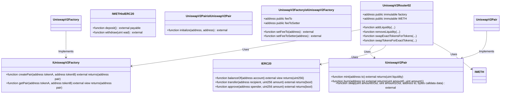
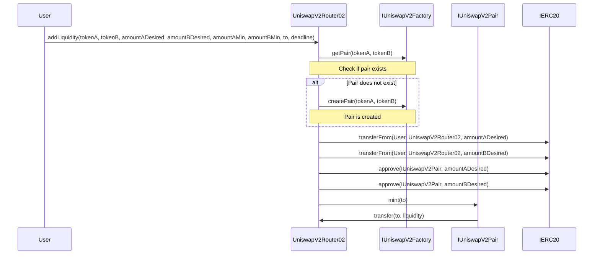

# Uniswap v2 with Solidity Version 0.8
## 
TokenA * TokenB = K

## UML

```mermaid
classDiagram
    class UniswapV2Router02 {
        +address public immutable factory
        +address public immutable WETH
        +function addLiquidity(...)
        +function removeLiquidity(...)
        +function swapExactTokensForTokens(...)
        +function swapTokensForExactTokens(...)
    }
    class IUniswapV2Factory {
        +function createPair(address tokenA, address tokenB) external returns (address pair)
        +function getPair(address tokenA, address tokenB) external view returns (address pair)
    }
    class IUniswapV2Pair {
        +function mint(address to) external returns (uint liquidity)
        +function burn(address to) external returns (uint amount0, uint amount1)
        +function swap(uint amount0Out, uint amount1Out, address to, bytes calldata data) external
    }
    class IERC20 {
        +function balanceOf(address account) external view returns (uint256)
        +function transfer(address recipient, uint256 amount) external returns (bool)
        +function approve(address spender, uint256 amount) external returns (bool)
    }
    class IWETH is IERC20 {
        +function deposit() external payable
        +function withdraw(uint wad) external
    }
    class UniswapV2Pair is IUniswapV2Pair {
        +function initialize(address, address) external
    }
    class UniswapV2Factory is IUniswapV2Factory {
        +address public feeTo
        +address public feeToSetter
        +function setFeeTo(address) external
        +function setFeeToSetter(address) external
    }
    UniswapV2Router02 --> IUniswapV2Factory : Uses
    UniswapV2Router02 --> IUniswapV2Pair : Uses
    UniswapV2Router02 --> IERC20 : Uses
    UniswapV2Router02 --> IWETH : Uses
    UniswapV2Pair --> IUniswapV2Pair : Implements
    UniswapV2Factory --> IUniswapV2Factory : Implements
```

## Sequence
### addLiquidity

```mermaid
sequenceDiagram
    participant User
    participant UniswapV2Router02
    participant IUniswapV2Factory
    participant IUniswapV2Pair
    participant IERC20
    User->>UniswapV2Router02: addLiquidity(tokenA, tokenB, amountADesired, amountBDesired, amountAMin, amountBMin, to, deadline)
    UniswapV2Router02->>IUniswapV2Factory: getPair(tokenA, tokenB)
    Note over IUniswapV2Factory, UniswapV2Router02: Check if pair exists
    alt Pair does not exist
        UniswapV2Router02->>IUniswapV2Factory: createPair(tokenA, tokenB)
        Note over IUniswapV2Factory, UniswapV2Router02: Pair is created
    end
    UniswapV2Router02->>IERC20: transferFrom(User, UniswapV2Router02, amountADesired)
    UniswapV2Router02->>IERC20: transferFrom(User, UniswapV2Router02, amountBDesired)
    UniswapV2Router02->>IERC20: approve(IUniswapV2Pair, amountADesired)
    UniswapV2Router02->>IERC20: approve(IUniswapV2Pair, amountBDesired)
    UniswapV2Router02->>IUniswapV2Pair: mint(to)
    IUniswapV2Pair->>UniswapV2Router02: transfer(to, liquidity)
```