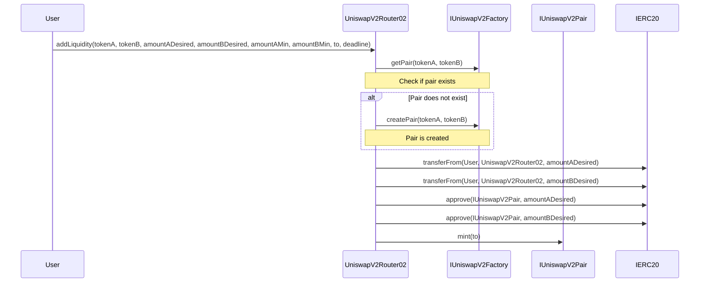
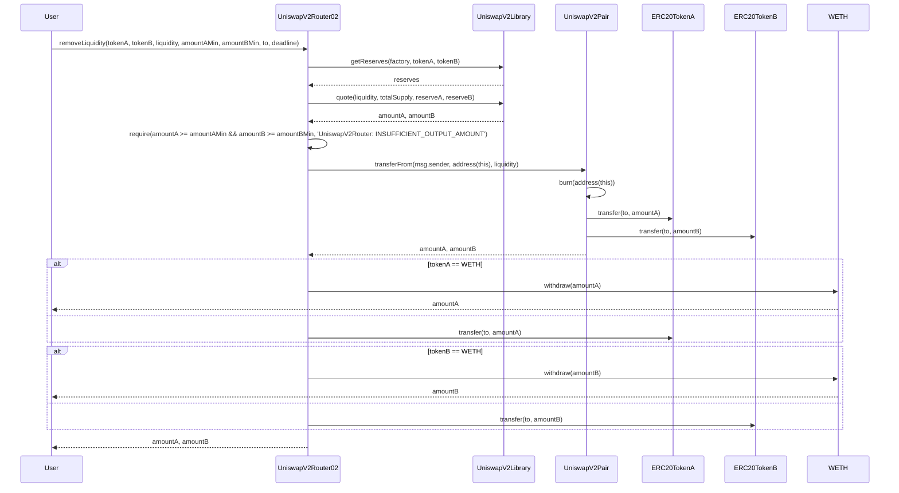

# Uniswap v2 with Solidity Version 0.8
## 
TokenA * TokenB = K

## UML


## Sequence
### addLiquidity

#### 
**Note**: addLiquidity not use all of tokenA and tokenB. it uses quote function.
amountB = amountA * ReserveB / ReserveA
```solidity
function quote(uint amountA, uint reserveA, uint reserveB) internal pure returns (uint amountB)
```
The specific method of calculating the value, whether using asset A as the standard to calculate asset B or using asset B as the standard to calculate asset A, depends on which method can provide higher liquidity.

The choice between the two methods is determined by which one can achieve greater liquidity.

#### How to calculate LP token:
The goal is to ensure that the value of the assets provided by the user is proportional to the number of LP tokens they receive.

if amount of LP token == 0
LPToken = sqrt(tokenA * tokenB)
if amount of LP token != 0
LPToken = min{amountA * priceA, amountB * priceB}
LPToken = min{amountA * LP totalSupply/ reserveA, amountB * LP totalSupply/ reserveB}

### Remove Liquidity

tokenA = LPToken / PriceA = LPToken * reserveA / LP totalSupply
tokenB = LPToken / PriceB = LPToken * reserveB / LP totalSupply